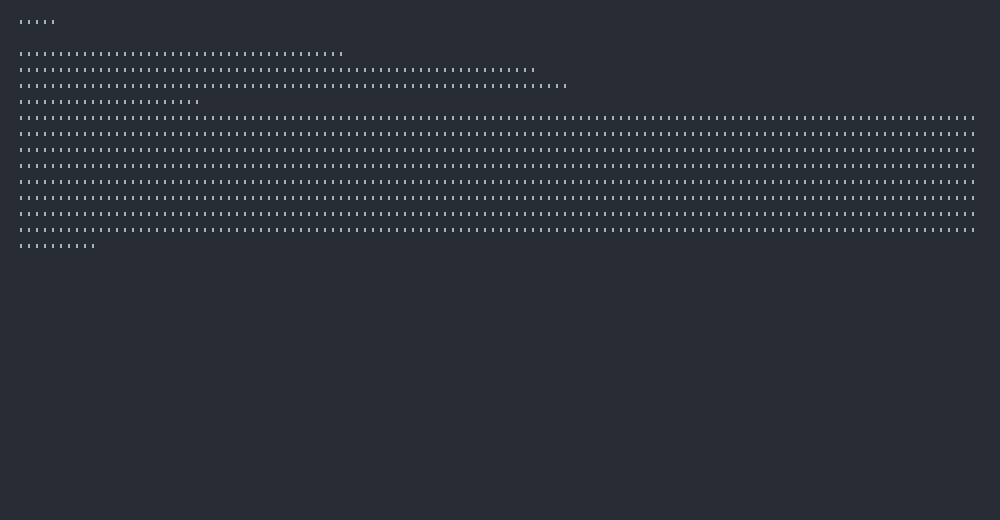
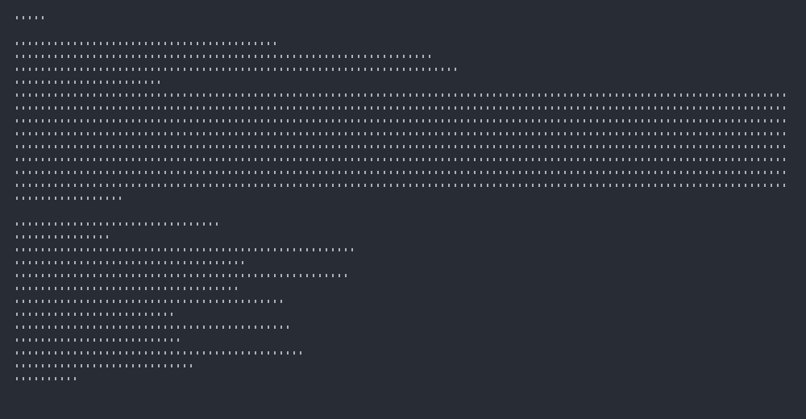
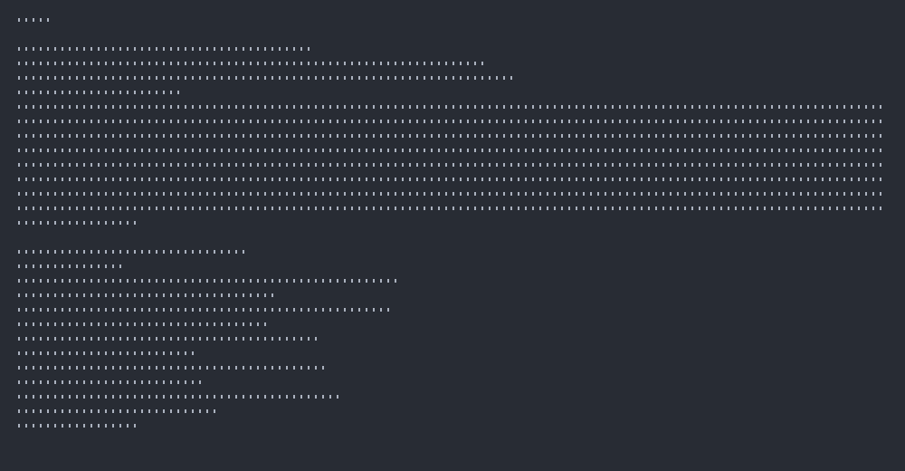

# KLA Demo Gallery 🎬

This directory contains demonstration screenshots and recordings generated using **KLA itself** - a perfect example of "eating our own dog food"! These demos showcase KLA's capabilities for creating beautiful terminal automation and documentation.

## 📸 Demo Screenshots

### KLA Banner

*Beautiful ASCII art banner generated with KLA automation*

### Features Overview

*Showcasing KLA's key features in a clean terminal display*

### Help Output

*KLA's command-line interface help documentation*

### Demo Completion

*Final screen showing successful completion of the automation demo*

### File Creation

*Showing the generated screenshot files from KLA automation*

### Quick Intro

*Simple introduction screenshot demonstrating basic KLA usage*

## 🎯 How These Were Created

All these demos were generated using KLA scripts! Here are the commands used:

### Screenshot Generation
```bash
# Create a simple intro screenshot
kla screenshot "echo '🎬 KLA - Beautiful CLI Automation' && echo 'Repository: github.com/KooshaPari/KommandLineAutomation'" --output demos/kla-intro.png

# Generate comprehensive showcase
kla record examples/kla-showcase.kla.yaml --output demos --format png
```

### Example Script Structure
```yaml
name: "KLA Showcase Demo"
settings:
  width: 120
  height: 30
  shell: "bash"
  theme: "default"

steps:
  - type: command
    text: "echo '🎬 KLA - Kommand Line Automation'"
    wait: "1s"
    
  - type: screenshot
    name: "demo-banner"
    
  - type: type
    text: "kla --help"
    speed: "30ms"
    
  - type: command
    text: ""
    wait: "2s"
```

## 🚀 Try It Yourself

Want to create your own demos? Here's how:

1. **Install KLA:**
   ```bash
   git clone https://github.com/KooshaPari/KommandLineAutomation.git
   cd KommandLineAutomation
   cargo build --release
   ```

2. **Create a script** (save as `my-demo.kla.yaml`):
   ```yaml
   name: "My Demo"
   settings:
     width: 100
     height: 25
     shell: "bash"
   
   steps:
     - type: command
       text: "echo 'Hello from KLA!'"
       wait: "1s"
     - type: screenshot
       name: "my-demo"
   ```

3. **Run your demo:**
   ```bash
   ./target/release/kla record my-demo.kla.yaml --output ./my-demos --format png
   ```

## 🎭 Meta Demonstration

These demos are particularly special because they demonstrate **KLA using KLA** - the ultimate meta example! The automation scripts:

1. **Run KLA commands** to show help output
2. **Execute KLA screenshots** within the demo
3. **Display KLA features** in beautiful terminal layouts
4. **Show the actual KLA workflow** in action

This creates a perfect recursive demonstration where the tool showcases itself, proving that KLA is production-ready and capable of creating professional documentation and demos.

## 🔗 Learn More

- **Repository:** [KooshaPari/KommandLineAutomation](https://github.com/KooshaPari/KommandLineAutomation)
- **Documentation:** See main [README.md](../README.md)
- **Examples:** Check out [examples/](../examples/) for more scripts
- **Architecture:** Review [ARCHITECTURE.md](../ARCHITECTURE.md) for technical details

---

*All demos generated with ❤️ using KLA*